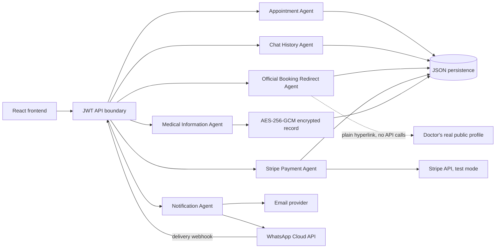

# MediGuide Agent Architecture

The backend owns agent decisions and the frontend owns patient input and presentation. Protected requests carry JWT bearer tokens. Production deployments must use HTTPS and a secret stored outside the repository.



## Appointment Agent

The agent recommends doctors, displays availability, validates the selected slot at commit time, creates the appointment, and requests notifications. The patient completes CAPTCHA or OTP where configured, chooses the doctor and preferred slot, reviews the confirmation, and explicitly authorizes booking.

```text
recommend doctor from chat result
display live schedule
patient chooses doctor and slot
patient completes CAPTCHA/OTP and reviews: "Book Dr. Ahmed at 10 AM?"
patient confirms
validate JWT, input, and slot again
create appointment atomically
invoke Notification Agent
return booking plus delivery state and manual-confirmation instructions on failure
```

## Chat History Agent

Each conversation has a stable ID. Turns are persisted, symptom entities remain in the QA session, and the internal disease classification is saved as authorized history metadata. Disease names are never returned as a diagnosis in chat responses.

## Notification Agent

`email` sends only email, `whatsapp` sends only WhatsApp, and `both` sends both. A missing preference is normalized to `both`; explicit preferences do not fall back to another channel. WhatsApp provider acceptance is stored as pending delivery and the webhook can update it to `delivered`, `read`, or `failed`. A notification failure does not erase a valid appointment. If real SMTP credentials are not set, email automatically falls back to an auto-provisioned Ethereal sandbox account (a real SMTP send, viewable via a preview link, but not delivered to the patient's actual inbox). If real WhatsApp Cloud API credentials are not set, WhatsApp automatically falls back to a clearly labeled simulation (the exact message is generated and logged, nothing is transmitted). Every attempt — real, sandboxed, or simulated — is written to a notifications log exposed at GET /notifications and shown on the in-app Notifications page.

## Medical Information Agent

Only the authenticated patient can read or update their blood group, allergies, medical history, and current medications. The fields are encrypted with AES-256-GCM before writing to `backend/data/medical-information.json`, using a key derived from `MEDIGUIDE_SECRET`. The plaintext is returned only after JWT authorization.

## Official Booking Redirect Agent

Takes a specialist plus the patient's reason for visit and preferred date/time
from a MediGuide form and returns a link to that doctor's real public profile
(the same URL the Appointment Agent already links to) with MediGuide-only UTM
tracking parameters appended, plus a copy-ready plain-text summary. It makes
no request to Marham/Oladoc, scrapes nothing, and does not attempt to fill in
fields inside their form — neither platform publishes a public API or URL
contract for that, so nothing here relies on one existing. Every generated
link is logged to `redirect-handoffs` for an audit trail. See
`backend/redirectBooking.mjs` for the exact mechanism and its limits.

## Stripe Payment Agent

A real Stripe integration (test mode), used as an optional step before a
redirect handoff. The backend creates a genuine Stripe `PaymentIntent`
(`backend/stripePayments.mjs`); the frontend collects the card with Stripe's
own `CardElement` and confirms it client-side via `stripe.confirmCardPayment()`
(`src/components/StripeCheckout.jsx`) — this app's own code never sees raw
card data. Before marking anything paid, the backend re-fetches the
PaymentIntent from Stripe's API rather than trusting the browser's report of
success. The fee amount for known purposes (e.g. the booking facilitation
fee) is fixed server-side and ignores whatever amount a client sends, closing
off a class of tampering the earlier simulated gateway was open to. A test
secret key (`STRIPE_SECRET_KEY`) means no real card network is ever
contacted, and no live payment is possible regardless of what card number is
typed — that guarantee comes from which key is configured, not from any
logic in this app. There is no webhook handler yet, so a payment that
succeeds on Stripe's side but never gets a `/confirm` call from the browser
(e.g. the tab closes mid-flow) won't be recorded — a production deployment
should add a Stripe webhook as the actual source of truth. See
`backend/stripePayments.mjs` and the "Follow-up pass: real Stripe payment
gateway" entry in `CHANGES.md`.

## Extensibility

Each agent exposes narrow service functions, allowing video consultation, multilingual response generation, a relational repository, and a queue-backed notification worker to be introduced without moving domain logic into React components.

## Python backend implementation

The same boundaries are implemented in `python_backend/app/agents/`:


The disease model trainer is `python_backend/app/agents/kaggle_training.py`. It reads `python_backend/data/medical/Training.csv` and `Testing.csv`, learns weighted symptom profiles for each disease, saves `kaggle-disease-model.json`, and writes `kaggle-evaluation-report.json`. The current dataset run contains 4,920 training records, 41 held-out records, 41 disease labels, and 131 one-hot symptom features. Current held-out results are top-1 accuracy 100%, top-3 accuracy 100%, macro precision 100%, macro recall 100%, and macro F1 100%. These scores are for the public teaching dataset's provided split and do not represent clinical accuracy.

The Python RAG implementation is in `python_backend/app/rag.py`. It contains 11 repository-owned topic documents, TF-IDF vectors, cosine similarity retrieval, top-three source IDs, source-linked precautions, and emergency flags. The persisted executable report is `python_backend/data/python-evaluation-report.json`, generated with `python -m python_backend.app.evaluation`.

Current Python benchmark results are intentionally scoped: the topic classifier and RAG each report local held-out topic-routing accuracy, while QA, appointment, and encryption checks report executable contract results. These are not clinical accuracy, clinician validation, or a diagnosis model. The repository does not contain the 4,920-record medical dataset described by the legacy JavaScript evaluation, so those JavaScript metrics are not claimed for Python.